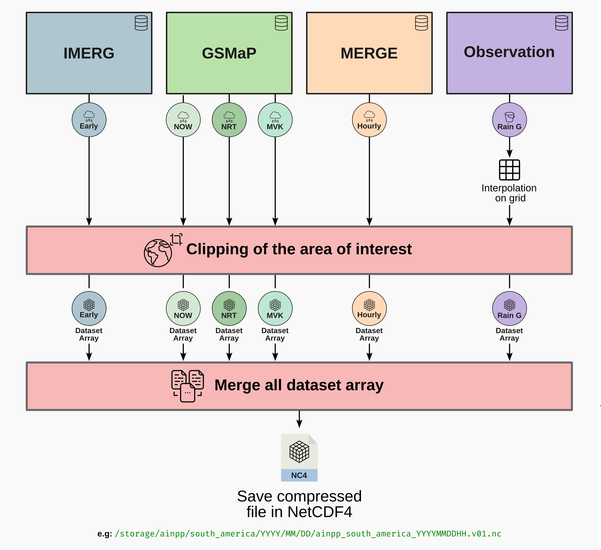

## 1. Project Overview

This document details the creation of a unified, precipitation dataset, generated by fusing multiple satellite products and observational rain gauge data. The goal is to provide a robust and consistent precipitation dataset for different spatial domains by combining the strengths of different data sources. The process, illustrated below, is automated by a Python script that acquires, processes, clips, regrids, and finally merges the data into a single NetCDF4 file per hour, optimized for scientific analysis, hydrological modeling, and climate studies.




## 2. Data Sources

The final dataset is a composition of the following primary sources:

| Product | Source | Native Spatial Resolution | Native Temporal Resolution | Estimated Latency | Variable in Final File |
| :--- | :--- | :--- | :--- | :--- | :--- |
| **IMERG Early** | NASA GPM | 0.1° x 0.1° | 30 minutes | ~4-6 hours | `imerg_early` |
| **GSMaP NOW** | JAXA | 0.1° x 0.1° | 30 minutes | ~0 hours (Nowcast) | `gsmap_now` |
| **GSMaP NRT** | JAXA | 0.1° x 0.1° | 1 hour | ~4 hours | `gsmap_nrt` |
| **GSMaP MVK** | JAXA | 0.1° x 0.1° | 1 hour | ~3 days | `gsmap_mvk` |
| **MERGE** | CPTEC/INPE | 0.1° x 0.1° | 1 hour | ~3-6 hours | `cptec_merge` |
| **Rain Gauge** | CPTEC/INPE | Point (Stations) | 1 hour | ~1-2 hours | `rain_gauge` |

### Data Source Details:

* **IMERG (Integrated Multi-satellitE Retrievals for GPM):** A global product from NASA that combines data from all satellites in the GPM constellation. The "Early Run" version is ideal for applications requiring speed, such as disaster monitoring.
* **GSMaP (Global Satellite Mapping of Precipitation):** Developed by JAXA, it also integrates multiple sensors.
    * **GSMaP NOW:** Provides a near-real-time precipitation estimate (nowcasting) with zero latency.
    * **GSMaP NRT:** "Near-Real-Time" version, with more refined processing than the NOW version and a latency of a few hours.
    * **GSMaP MVK:** The final, reanalyzed, and gauge-corrected version, considered the most accurate but with the highest latency.
* **MERGE:** A product from CPTEC/INPE that combines satellite estimates (GOES) with rain gauge data, focused on South America.
* **Rain Gauge Data:** These are the direct "ground truth" observations from the CPTEC/INPE network of weather stations. Although very accurate, they are spatially sparse.

## 3. Processing Methodology

The Python script executes a series of steps for each hour in the defined time range:

1.  **Data Acquisition:** For each hour, the script constructs the expected file paths for each data product using predefined templates. It then locates the corresponding files in the storage system.

2.  **Individual Processing:** Each file type is read and pre-processed:
    * **NetCDF (IMERG, GSMaP MVK):** Files are opened with `xarray`, variables of interest are renamed to a standard (`imerg_early`, `gsmap_mvk`), and the data is clipped to the South American area of interest (`lat: -55° to 13°`, `lon: -83° to -33°`).
    * **GRIB (MERGE):** The file is read using `xarray` with the `cfgrib` engine. The longitude, originally in 0-360 format, is converted to the standard -180 to 180.
    * **Gzipped Binary (GSMaP NRT/NOW):** These `dat.gz` files are read as binary data, reshaped to their original 2D matrix, and reordered to align with the standard longitude grid.
    * **Text (Rain Gauge):** The text file is read with `pandas`, filtered for the hour of interest, and the latitude, longitude, and precipitation data are extracted.

3.  **Rain Gauge Data Interpolation:**
    Since rain gauge data are point-based (each at a specific coordinate), they must be interpolated onto the same regular grid as the other products. The method used was **Nearest Neighbor** via the `griddata` function from the `scipy` library.
    * **How it works:** For each cell in the output grid (0.1° x 0.1°), the algorithm identifies the geographically closest rain gauge station and assigns that station's precipitation value to the grid cell.
    * **Why this method?** It was chosen for its simplicity and robustness. It does not create artificial precipitation values between stations, which could happen with methods like linear or cubic interpolation, especially in areas with sparse stations. It preserves the original measured values, assigning them to their area of greatest influence.

4.  **Regridding to a Common Grid:**
    Although most products have a native resolution of 0.1°, slight differences in their grids can exist. To ensure a perfect merge, all processed datasets are interpolated to a single, standardized target grid (0.1° resolution) using the `interp_like` function from `xarray`.

5.  **Merging:**
    With all datasets on the same grid, the `xarray.merge` function is used to combine them into a single `xarray.Dataset`. Each source product becomes a separate data variable in this new dataset, sharing the same `lat` and `lon` coordinates.

6.  **Saving:**
    The final `Dataset` is saved in **NetCDF4** format, with `zlib` compression applied to all variables to optimize storage space without data loss.

## 4. How to Use the Generated Data

The NetCDF files can be easily opened and analyzed with Python, primarily using the `xarray`, `matplotlib`, and `cartopy` libraries.

### 4.1. Opening and Exploring the File

First, install the necessary libraries:
```bash
pip install xarray netcdf4 matplotlib cartopy
```

Use the following code to open a file and view its contents.

```python
import xarray as xr

# Define constants for your region of interest
LON_MIN, LON_MAX = -83.0, -33.0
LAT_MIN, LAT_MAX = -55.0, 13.0

# Open the generated NetCDF file
file_path = 'ainpp_south_america_2023030100.v01.nc'
try:
    merged_ds = xr.open_dataset(file_path)

    # Explore the dataset's structure
    print("Dataset Structure:")
    print(merged_ds)

    # See the available data variables
    print("\nAvailable data variables:")
    print(list(merged_ds.data_vars))

    # Access the data for a specific variable (e.g., IMERG)
    imerg_data = merged_ds['imerg_early']
    print("\nDimensions and Coordinates of 'imerg_early' variable:")
    print(imerg_data)

except FileNotFoundError:
    print(f"Error: The file '{file_path}' was not found.")
```

### 4.2. Spatial Visualization (Plotting Maps)

The following example plots a precipitation map for the `cptec_merge` variable.

```python
import matplotlib.pyplot as plt
import cartopy.crs as ccrs
import cartopy.feature as cfeature

# Assuming 'merged_ds' is already loaded from the previous step
if 'merged_ds' in locals():
    # Select the variable to plot
    data_to_plot = merged_ds['cptec_merge']

    # Create the figure and axes with a map projection
    fig = plt.figure(figsize=(8, 10))
    ax = fig.add_subplot(1, 1, 1, projection=ccrs.PlateCarree())

    # Set the map extent
    ax.set_extent([LON_MIN, LON_MAX, LAT_MIN, LAT_MAX], crs=ccrs.PlateCarree())

    # Plot the data
    # 'cmap' defines the color palette (e.g., 'viridis', 'jet', 'Blues')
    im = data_to_plot.plot(
        ax=ax,
        transform=ccrs.PlateCarree(),
        cmap='viridis',
        cbar_kwargs={'label': 'Precipitation (mm/hr)'}
    )

    # Add geographic features
    ax.add_feature(cfeature.COASTLINE)
    ax.add_feature(cfeature.BORDERS, linestyle=':')
    ax.add_feature(cfeature.STATES, linestyle=':')

    # Add gridlines
    ax.gridlines(draw_labels=True, dms=True, x_inline=False, y_inline=False)

    # Add a title
    ax.set_title('Estimated Precipitation from MERGE\n2023-03-01 00:00 UTC', fontsize=14)

    plt.show()
```

### 4.3. Spatial and Temporal Analysis

You can perform various analyses, such as calculating the difference between products or the average precipitation over an area.

#### Example: Difference between IMERG and Interpolated Rain Gauge

This code calculates and plots the difference (bias) between the IMERG satellite estimate and the interpolated rain gauge observation.

```python
if 'merged_ds' in locals() and 'imerg_early' in merged_ds and 'rain_gauge' in merged_ds:
    # Calculate the difference
    bias = merged_ds['imerg_early'] - merged_ds['rain_gauge']

    # Plot the bias map
    fig = plt.figure(figsize=(8, 10))
    ax = fig.add_subplot(1, 1, 1, projection=ccrs.PlateCarree())
    ax.set_extent([LON_MIN, LON_MAX, LAT_MIN, LAT_MAX], crs=ccrs.PlateCarree())

    # Use a diverging colormap (e.g., 'coolwarm', 'bwr', 'RdBu')
    bias.plot(
        ax=ax,
        transform=ccrs.PlateCarree(),
        cmap='RdBu',
        cbar_kwargs={'label': 'Precipitation Difference (IMERG - Gauge) (mm/hr)'}
    )

    ax.add_feature(cfeature.COASTLINE)
    ax.add_feature(cfeature.BORDERS, linestyle=':')
    ax.gridlines(draw_labels=True, dms=True, x_inline=False, y_inline=False)
    ax.set_title('Bias between IMERG and Rain Gauges', fontsize=14)

    plt.show()
```

Blue areas indicate that IMERG underestimated the rain compared to the gauges, while red areas indicate an overestimation.