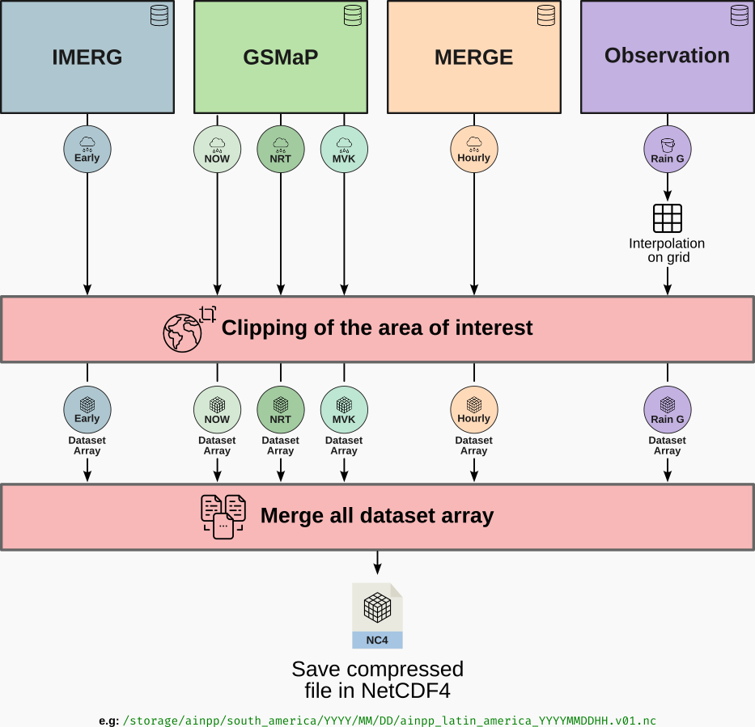

## 1. Project Overview

This document details the creation of a unified, precipitation dataset, generated by fusing multiple satellite products and observational rain gauge data. The goal is to provide a robust and consistent precipitation dataset for different spatial domains by combining the strengths of different data sources. The process, illustrated below, is automated by a Python script that acquires, processes, clips, regrids, and finally merges the data into a single NetCDF4 file per hour, optimized for scientific analysis, hydrological modeling, and climate studies.




## 2. Data Sources

The final dataset is a composition of the following primary sources:

| Product | Source | Native Spatial Resolution | Native Temporal Resolution | Estimated Latency | Variable in Final File |
| :--- | :--- | :--- | :--- | :--- | :--- |
| **IMERG Early** | NASA GPM | 0.1° x 0.1° | 30 minutes | ~4-6 hours | `imerg_early` |
| **GSMaP NOW** | JAXA | 0.1° x 0.1° | 30 minutes | ~0 hours (Nowcast) | `gsmap_now` |
| **GSMaP NRT** | JAXA | 0.1° x 0.1° | 1 hour | ~4 hours | `gsmap_nrt` |
| **GSMaP MVK** | JAXA | 0.1° x 0.1° | 1 hour | ~3 days | `gsmap_mvk` |
| **MERGE** | CPTEC/INPE | 0.1° x 0.1° | 1 hour | ~3-6 hours | `cptec_merge` |
| **Rain Gauge** | CPTEC/INPE | Point (Stations) | 1 hour | ~1-2 hours | `rain_gauge` |

### Data Source Details:

* **IMERG (Integrated Multi-satellitE Retrievals for GPM):** A global product from NASA that combines data from all satellites in the GPM constellation. The "Early Run" version is ideal for applications requiring speed, such as disaster monitoring.
* **GSMaP (Global Satellite Mapping of Precipitation):** Developed by JAXA, it also integrates multiple sensors.
    * **GSMaP NOW:** Provides a near-real-time precipitation estimate (nowcasting) with zero latency.
    * **GSMaP NRT:** "Near-Real-Time" version, with more refined processing than the NOW version and a latency of a few hours.
    * **GSMaP MVK:** The final, reanalyzed, and gauge-corrected version, considered the most accurate but with the highest latency.
* **MERGE:** A product from CPTEC/INPE that combines satellite estimates (GOES) with rain gauge data, focused on Latin America.
* **Rain Gauge Data:** These are the direct "ground truth" observations from the CPTEC/INPE network of weather stations. Although very accurate, they are spatially sparse.

## 3. Processing Methodology

The Python script executes a series of steps for each hour in the defined time range:

1.  **Data Acquisition:** For each hour, the script constructs the expected file paths for each data product using predefined templates. It then locates the corresponding files in the storage system.

2.  **Individual Processing:** Each file type is read and pre-processed:
    * **NetCDF (IMERG, GSMaP MVK):** Files are opened with `xarray`, variables of interest are renamed to a standard (`imerg_early`, `gsmap_mvk`), and the data is clipped to the Latin American area of interest (`lat: -55° to 33°`, `lon: -120° to -23°`).
    * **GRIB (MERGE):** The file is read using `xarray` with the `cfgrib` engine. The longitude, originally in 0-360 format, is converted to the standard -180 to 180.
    * **Gzipped Binary (GSMaP NRT/NOW):** These `dat.gz` files are read as binary data, reshaped to their original 2D matrix, and reordered to align with the standard longitude grid.
    * **Text (Rain Gauge):** The text file is read with `pandas`, filtered for the hour of interest, and the latitude, longitude, and precipitation data are extracted.

3.  **Rain Gauge Data Interpolation:**
    Since rain gauge data are point-based (each at a specific coordinate), they must be interpolated onto the same regular grid as the other products. The method used was the average precipitation of each 10km X 10km area.

4.  **Regridding to a Common Grid:**
    Although most products have a native resolution of 0.1°, slight differences in their grids can exist. To ensure a perfect merge, all processed datasets are interpolated to a single, standardized target grid (0.1° resolution) using the `interp_like` function from `xarray`.

5.  **Merging:**
    With all datasets on the same grid, the `xarray.merge` function is used to combine them into a single `xarray.Dataset`. Each source product becomes a separate data variable in this new dataset, sharing the same `lat` and `lon` coordinates.

6.  **Saving:**
    The final `Dataset` is saved in **NetCDF4** format, with `zlib` compression applied to all variables to optimize storage space without data loss.

## 4. How to Use the Generated Data

The NetCDF files can be easily opened and analyzed with Python, primarily using the `xarray`, `matplotlib`, and `cartopy` libraries.

### 4.1. Opening and Exploring the File

First, install the necessary libraries:
```bash
pip install xarray netcdf4 matplotlib cartopy
```

Use the following code to open a file and view its contents.

```python
import xarray as xr

# Open the generated NetCDF file
file_path = 'ainpp_latin_america_20240101*.v01.nc'
try:
    ds = ds = xr.open_mfdataset(
        file_path
    )
    ds = ds.sum(dim='time').compute()

    # Explore the dataset's structure
    print("Dataset Structure:")
    print(ds)

    # See the available data variables
    print("\nAvailable data variables:")
    print(list(ds.data_vars))

    # Access the data for a specific variable (e.g., IMERG)
    imerg_data = ds['imerg_early']
    print("\nDimensions and Coordinates of 'imerg_early' variable:")
    print(imerg_data)

except FileNotFoundError:
    print(f"Error: The file '{file_path}' was not found.")
```

### 4.2. Spatial Visualization (Plotting Maps)

The following example plots a precipitation map for the `all` variables.

```python
import matplotlib.pyplot as plt
import matplotlib.colors as mcolors
import cartopy.crs as ccrs
import cartopy.feature as cfeature

PRECIP_BOUNDS = [1.0, 2.0, 5.0, 10.0, 20.0, 50.0, 100.0, 200.0, 600.0]
PRECIP_COLORS_DAILY = [
    '#f7fbff', 
    '#deebf7',
    '#c6dbef',
    '#9ecae1',
    '#6baed6',
    '#4292c6',
    '#2171b5',
    '#08519c',
    '#08306b'  
]

cmap_daily = mcolors.ListedColormap(PRECIP_COLORS_DAILY, name='DailyPrecip')
cmap_daily.set_under('none')
cmap_daily.set_over('#041f5b')  
norm_daily = mcolors.BoundaryNorm(PRECIP_BOUNDS, cmap_daily.N - 1, clip=False)

fig, axs = plt.subplots(2, 3, figsize=(15, 10), subplot_kw={'projection': ccrs.PlateCarree()})

variables = [
    'imerg_early',
    'gsmap_nrt',
    'gsmap_now',
    'gsmap_mvk',
    'cptec_merge',
    'rain_gauge'
]

titles = [
    'IMERG Early',
    'GSMaP NRT',
    'GSMaP Now',
    'GSMaP MVK',
    'CPTEC Merge',
    'Rain Gauge'
]

for i, var in enumerate(variables):
    ax = axs[i // 3, i % 3]
    ds[var].plot.pcolormesh(
        ax=ax,
        transform=ccrs.PlateCarree(),
        cmap=cmap_daily,
        norm=norm_daily,
        shading='auto',  # Use 'auto' or 'gouraud' or 'nearest'
        zorder=2,
        add_colorbar=False,
    )
    
    ax.set_title(f"{titles[i]}", y=1.05, fontsize=12)
    ax.set_title(date, loc='right', fontsize=8)
    ax.coastlines()
    ax.add_feature(cfeature.BORDERS)
    # ax.add_feature(cfeature.LAND)
    ax.add_feature(cfeature.COASTLINE)
    # decrease the size of colorbar
    cbar = plt.colorbar(ax.collections[0], ax=ax, orientation='horizontal', pad=0.05, aspect=50)
    cbar.set_label('Precipitation (mm/d)')


# remove hspace
plt.subplots_adjust(hspace=0.1, wspace=0.1)

plt.show()
```

Below is presented an example plot of all variables:


